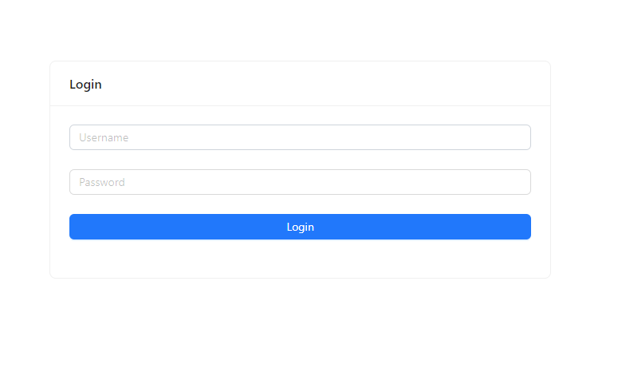
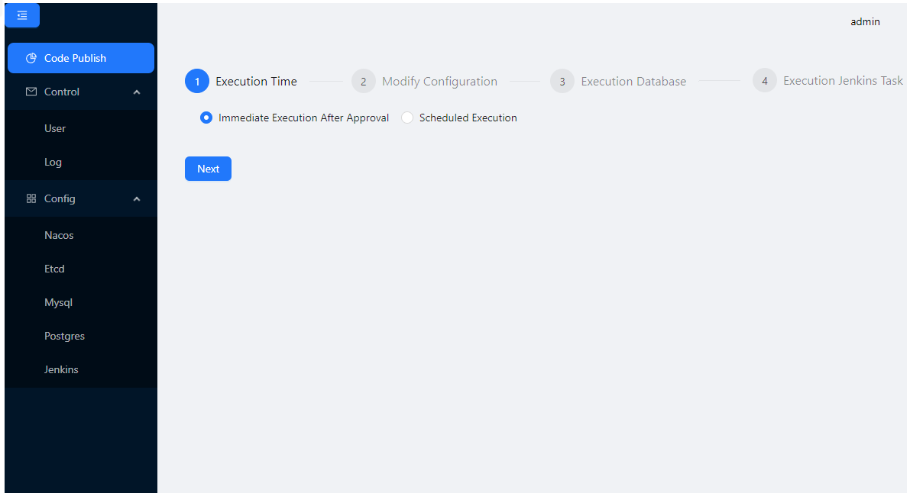

# codepub-front

This frontend project provides a simple web interface for code publish using the Vite framework.

### Example

admin/admin





### Usage

Build Docker Image

```
docker build -t legendzzzaioi/codepub-front:v1 .
```

Run Docker Container

```
docker run --name codepub-front \
  --link codepub-service:codepub-service \
  --restart always \
  -p 80:80 \
  -d legendzzzaioi/codepub-front:v1
```

Usage with Kubernetes

```
# modify codepub-front.yaml
kubectl -n xxx apply -f codepub-front.yaml
```